# FTPS_homelab_IIS_port-forwarded
### Personal documentation: My HomeLab FTPS setup/configuration using the Windows IIS feature, with port forwarding

### IP Bindings
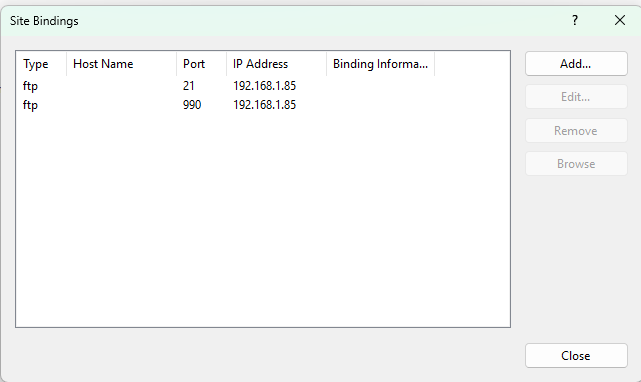

---

### Passive port range
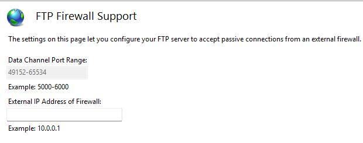
---

### Windows Firewall
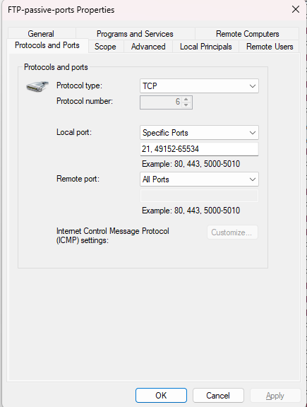

---

### Port Forwarding Configuration
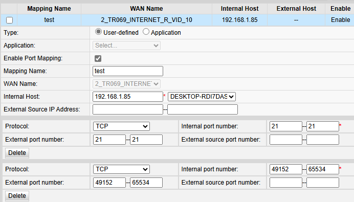
---

### FTP Authentication
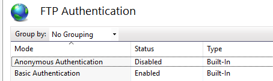
---

### FTP Authorization Rule
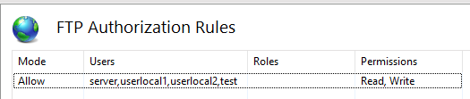
---

### FTP User Isolation
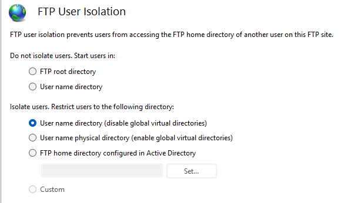
---

### SSL
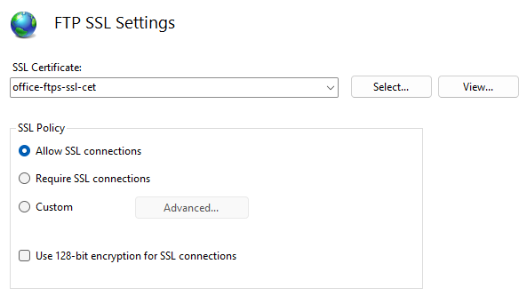
---

### FTP Logs Configuration
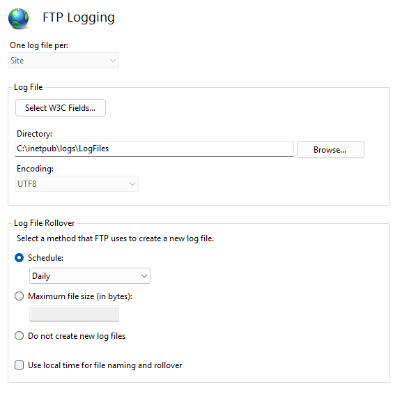
---

### FTP root folder structure
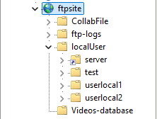
---

### NTFS Permission Configuration
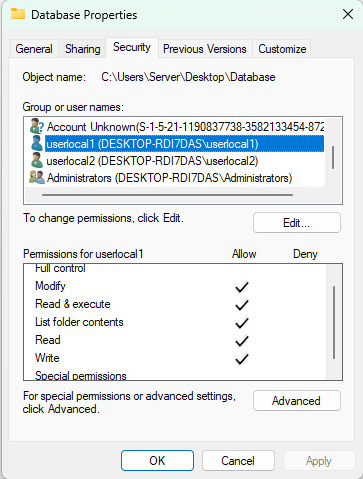
